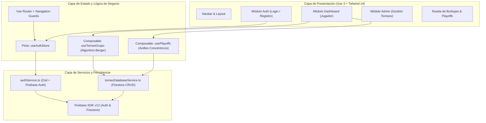

# 🏓 PingPongPage — Sistema de Gestión de Torneos de Tenis de Mesa

Plataforma web integral y moderna para la organización, administración y seguimiento interactivo de torneos de tenis de mesa (ping pong). Diseñada con una arquitectura modular, reactividad en tiempo real y una experiencia de usuario orientada a comunidades deportivas, campers y staff.

---

## 📑 Tabla de Contenidos

1. [Visión General del Proyecto](#-visión-general-del-proyecto)
2. [Estado Actual del Proyecto](#-estado-actual-del-proyecto)
3. [Stack Tecnológico y Versiones](#-stack-tecnológico-y-versiones)
4. [Arquitectura del Software](#-arquitectura-del-software)
   - [Estructura de Carpetas](#estructura-de-carpetas)
   - [Diagrama de Flujo y Arquitectura](#diagrama-de-flujo-y-arquitectura)
   - [Flujo de Autenticación y Guards](#flujo-de-autenticación-y-guards)
5. [Módulos y Funcionalidades Clave](#-módulos-y-funcionalidades-clave)
   - [Módulo de Autenticación (`auth`)](#1-módulo-de-autenticación-auth)
   - [Módulo del Dashboard de Jugador (`dashboard`)](#2-módulo-del-dashboard-de-jugador-dashboard)
   - [Módulo de Administración (`admin`)](#3-módulo-de-administración-admin)
   - [Sistema de Torneos y Algoritmos](#4-sistema-de-torneos-y-algoritmos)
6. [Sistema de Diseño y Estilos](#-sistema-de-diseño-y-estilos)
7. [Cosas a Tener en Cuenta (Consideraciones Técnicas)](#-cosas-a-tener-en-cuenta-consideraciones-técnicas)
8. [Instalación y Puesta en Marcha](#-instalación-y-puesta-en-marcha)
9. [Despliegue](#-despliegue)

---

## 🎯 Visión General del Proyecto

**PingPongPage** es una Single Page Application (SPA) desarrollada con **Vue 3**, **TypeScript** y **Tailwind CSS v4**, respaldada por los servicios de **Firebase (Auth & Firestore)**.

El objetivo central es digitalizar la experiencia de un torneo de tenis de mesa:
- Automatizar el emparejamiento por jornadas utilizando el **algoritmo de Berger (Round Robin)**.
- Facilitar el arbitraje comunitario y seguro entre jugadores mediante **PINes dinámicos de 5 dígitos**.
- Visualizar el avance del torneo a través de una **Rueda Radial de Burbujas** y una estructura de **Eliminatorias Concéntricas Orbitales** (Playoffs).
- Brindar a los administradores control total sobre la aprobación de inscripciones, verificación de pagos bancarios y resolución de partidos en disputa.

---

## 🚀 Estado Actual del Proyecto

El proyecto se encuentra en una fase funcional y avanzada, con los siguientes hitos completados:

| Área / Módulo | Estado | Descripción |
| :--- | :---: | :--- |
| **Autenticación y Perfiles** | ✅ Completo | Login, Registro segmentado (Camper / Trabajador), manejo de sesión persistente con Firebase Auth y perfiles en Firestore. |
| **Protección de Rutas (Guards)** | ✅ Completo | Middleware en Vue Router con espera asíncrona de inicialización de sesión y control estricto de roles (`admin` vs `jugador`). |
| **Dashboard de Jugador** | ✅ Completo | Exploración de torneos disponibles, gestión de torneos inscritos, banners informativos y KPIs personales. |
| **Inscripciones y Pagos** | ✅ Completo | Flujo de solicitud de cupo, subida/revisión de comprobantes y validación de estados de pago. |
| **Visualización Radial (Rueda de Burbujas)** | ✅ Completo | Posicionamiento trigonométrico de rivales alrededor del jugador central con estados cromáticos (verde, rojo, naranja, azul pulsante). |
| **Tabla de Posiciones en Vivo** | ✅ Completo | Clasificación Round Robin con desempates reglamentarios oficiales ITTF (PJ, PG, PP, Sets a Favor, Sets en Contra, Diferencial y Puntos). |
| **Fase 2: Eliminatorias Concéntricas** | ✅ Completo | Visualización de playoffs en 3 anillos orbitales concéntricos (Play-In, Cuartos/Semis y Gran Final hacia la Corona). |
| **Sistema de Arbitraje y Marcador Virtual** | ✅ Completo | Registro de sets al mejor de 3, validación por código PIN dinámico contra suplantación y registro de "mallas" para premio especial al Mallero Mayor. |
| **Panel de Administración** | ✅ Completo | Creación de torneos, cambio de fases, gestión de inscripciones, resolución manual de empates/conflictos y generador de datos demo. |
| **Sistema de Temas (Theming)** | ✅ Completo | Soporte para Modo Claro y Modo Oscuro (*Olympic Table & Neon Ball*) con paleta personalizada de tenis de mesa. |

---

## 🛠 Stack Tecnológico y Versiones

Las dependencias principales y sus versiones declaradas en `package.json` son:

### Dependencias Principales (`dependencies`)
- **[Vue.js](https://vuejs.org/) (`^3.5.40`)**: Framework progresivo utilizando la **Composition API** con sintaxis `<script setup>` y tipado estricto.
- **[Vue Router](https://router.vuejs.org/) (`^4.6.4`)**: Enrutador oficial para SPAs con navegación basada en historial (`createWebHistory`) y Navigation Guards.
- **[Pinia](https://pinia.vuejs.org/) (`^4.0.3`)**: Almacén de estado global reactivo y modular para gestionar la sesión del usuario.
- **[Firebase SDK](https://firebase.google.com/) (`^12.18.0`)**: Servicios Backend-as-a-Service para:
  - **Firebase Authentication**: Autenticación mediante Correo y Contraseña.
  - **Cloud Firestore**: Base de datos NoSQL documental para torneos, partidos, inscripciones y usuarios.
- **[Zod](https://zod.dev/) (`^3.24.2`)**: Validación de esquemas TypeScript en tiempo de ejecución.
- **[Vee-Validate](https://vee-validate.logaretm.com/) (`^4.15.1`)** & **`@vee-validate/zod` (`^4.15.1`)**: Gestión de formularios reactivos y validaciones integradas.
- **[Lucide Vue Next](https://lucide.dev/) (`^1.0.0`)**: Paquete de iconos vectoriales optimizados para Vue.

### Dependencias de Desarrollo (`devDependencies`)
- **[Vite](https://vite.dev/) (`^8.1.5`)**: Herramienta de compilación ultrarrápida (HMR) y empaquetado de última generación.
- **[@tailwindcss/vite](https://tailwindcss.com/) (`^4.3.3`)** & **[Tailwind CSS](https://tailwindcss.com/) (`^4.3.3`)**: Motor CSS utility-first de última generación (v4) integrado nativamente con Vite vía plugin.
- **[Sass](https://sass-lang.com/) (`^1.103.1`)**: Preprocesador CSS para tokens de diseño y componentes especializados.
- **[TypeScript](https://www.typescriptlang.org/) (`~6.0.0`)**: Tipado estricto en toda la aplicación.
- **[vue-tsc](https://github.com/vuejs/language-tools) (`^3.3.7`)**: Verificación de tipos específica para SFCs (`.vue`).
- **[npm-run-all2](https://github.com/bcomnes/npm-run-all2) (`^9.0.2`)**: Ejecución concurrente y secuencial de scripts npm.

### Requisitos de Entorno de Ejecución (`engines`)
- **Node.js**: `^22.18.0 || >=24.12.0`

---

## 🏛 Arquitectura del Software

El proyecto implementa una **Arquitectura Modular Orientada a Dominio/Funcionalidad** (*Feature-driven modular architecture*), complementada con capas transversales para componentes base, servicios y estado global.

### Estructura de Carpetas

```plaintext
PingPongPage/
├── .firebase/                 # Archivos de caché e información de Firebase Hosting
├── public/                    # Recursos estáticos servidos directamente
├── src/
│   ├── assets/                # Hojas de estilo y recursos gráficos
│   │   ├── styles/
│   │   │   ├── fonts.scss        # Fuentes tipográficas (Google Font 'Manrope')
│   │   │   ├── primitives.scss   # Tokens primitivos de color (ITTF Olympic Blue, Neon Orange, etc.)
│   │   │   ├── components.scss   # Clases utilitarias de componentes reutilizables
│   │   │   └── main.scss         # Hoja principal que reúne los estilos SCSS
│   │   └── main.css           # Configuración de Tailwind CSS v4 (@import "tailwindcss", @theme)
│   ├── components/            # Componentes atómicos e interfaces compartidas
│   │   ├── Button.vue            # Botón accesible con variantes (primary, outline, ghost)
│   │   ├── Card.vue              # Contenedor de tarjeta estándar
│   │   ├── Input.vue             # Campo de texto controlado con soporte para errores
│   │   ├── Modal.vue             # Modal genérico accesible
│   │   ├── Navbar.vue            # Barra de navegación principal con estado de usuario
│   │   ├── Footer.vue            # Pie de página institucional
│   │   ├── ModalReglamento.vue   # Modal informativo del reglamento oficial ITTF
│   │   └── ThemeTogglePingPong.vue # Interruptor interactivo de Modo Claro / Modo Oscuro
│   ├── composables/           # Lógica reutilizable y estado transversal
│   │   ├── useTheme.ts           # Gestión reactiva de tema (dark/light con persistencia)
│   │   └── useReglamento.ts      # Estado para abrir/cerrar el reglamento deportivo
│   ├── modules/               # Módulos de dominio encapsulados
│   │   ├── auth/              # Módulo de Autenticación
│   │   │   ├── schemas/          # Esquemas de validación Zod (authSchemas.ts)
│   │   │   ├── service/          # Integración directa con Firebase Auth y Firestore (authService.ts)
│   │   │   └── views/            # LoginView, RegisterView y partials (SelectorTipoUsuario.vue)
│   │   ├── dashboard/         # Módulo Principal del Jugador
│   │   │   ├── composables/      # Lógica de cálculo (useTorneoGrupo.ts, usePlayoffs.ts)
│   │   │   └── views/
│   │   │       ├── DashboardView.vue # Vista principal del participante
│   │   │       └── partials/
│   │   │           ├── arbitraje/    # Modales de arbitraje y marcador virtual interactivo
│   │   │           ├── dashboard/    # Tarjetas de torneo, filtros, KPIs, comprobantes de pago
│   │   │           └── participacion/# Rueda de burbujas, tabla de posiciones y eliminatorias
│   │   └── admin/             # Módulo de Administración
│   │       ├── components/       # Modales de creación, gestión, comprobantes y resolución de partidos
│   │       └── views/
│   │           └── AdminDashboardView.vue # Panel de control del administrador
│   ├── router/                # Configuración de rutas y Navigation Guards (index.ts)
│   ├── services/              # Infraestructura de servicios externos
│   │   ├── firebase.ts           # Instancia inicializada de Firebase App, Auth y Firestore
│   │   └── torneoDatabaseService.ts # Operaciones CRUD para torneos, partidos e inscripciones
│   ├── stores/                # Estado global con Pinia
│   │   └── auth.ts               # Store de sesión, perfil de usuario y permisos
│   ├── types/                 # Interfaces y contratos de TypeScript
│   │   └── index.ts              # Modelos de datos de Torneo, Partido, Jugador, Playoffs, etc.
│   ├── App.vue                # Componente raíz de la aplicación
│   └── main.ts                # Entrada principal de la aplicación (inicialización de Vue, Pinia y Router)
├── .env.example               # Plantilla de variables de entorno requeridas
├── firebase.json              # Configuración de despliegue para Firebase Hosting
├── tsconfig.json              # Configuración base de TypeScript
├── vite.config.ts             # Configuración de compilación de Vite y alias @
└── package.json               # Definición de dependencias y scripts del proyecto
```

---

### 🔄 Diagrama de Flujo y Arquitectura



---

### 🛡 Flujo de Autenticación y Guards

El enrutador (`src/router/index.ts`) cuenta con un guard global `beforeEach` que previene condiciones de carrera al recargar la página:

1. **Espera de Inicialización**: Si Firebase aún no ha emitido el primer evento de `onAuthStateChanged`, el guard aguarda mediante la promesa `authStore.esperarInicializacion()`.
2. **Rutas Protegidas (`requiresAuth`)**: Redirecciona a `/login` si el usuario no tiene una sesión activa.
3. **Protección de Rol Administrativo (`requiresAdmin`)**: Verifica estrictamente que `authStore.esAdmin === true`. Si no lo es, redirige a `/` sin permitir el acceso al panel administrativo.
4. **Rutas para Invitados (`guestOnly`)**: Redirecciona al dashboard principal si un usuario ya autenticado intenta acceder a `/login` o `/registro`.

---

## ⚡ Módulos y Funcionalidades Clave

### 1. Módulo de Autenticación (`auth`)
- **Registro de Usuarios**: Permite registrar nombre, apellido, correo institucional/personal, teléfono y tipo de usuario (`camper` o `trabajador`).
- **Validación con Zod**: Esquemas estrictos que garantizan contraseñas seguras y coincidencia de confirmación antes de impactar el backend.
- **Mapeo de Errores Firebase**: Traducción y sanitización amigable de códigos de error de Firebase (ej. correo ya en uso, credenciales incorrectas, contraseña débil).

### 2. Módulo del Dashboard de Jugador (`dashboard`)
- **Pestaña "Mis Torneos"**: Listado de torneos en los que el usuario está inscrito con filtros rápidos por estado (`por iniciar`, `en curso`, `finalizado`, `en verificación`).
- **Pestaña "Torneos Disponibles"**: Catálogo de eventos abiertos a inscripción con información de costo, cupos, modalidad y fecha límite.
- **Comprobante de Pago**: Modal para cargar y consultar la verificación del pago de la inscripción.
- **KPIs y Estadísticas**: Métricas en tiempo real de torneos jugados y rendimiento del jugador.

### 3. Módulo de Administración (`admin`)
- **Control de Torneos**: Creación de nuevos torneos con parámetros como cupos, fecha límite, número de cuenta bancaria y contacto de WhatsApp.
- **Gestor de Estados**: Transición de estado en un clic (`por iniciar` ➔ `en curso` ➔ `finalizado`).
- **Aprobación de Inscripciones**: Verificación de comprobantes de pago de los participantes y admisión oficial.
- **Resolución de Conflictos**: Herramienta administrativa para desbloquear partidos con discrepancias o pendientes de revisión (`ModalResolverPartidoAdmin.vue`).
- **Generador de Datos Demo**: Permite crear participantes y escenarios de partidos hiperrealistas en Firestore con un solo clic para pruebas y demostraciones.

### 4. Sistema de Torneos y Algoritmos
- **Algoritmo de Berger**: Generación determinista del fixture de Round Robin (todos contra todos) por jornadas, incluyendo manejo de descansos (`BYE`) para cantidades impares de participantes.
- **Rueda de Burbujas (Bubble Wheel)**: Distribución trigonométrica interactiva de los contrincantes alrededor del avatar central del usuario:
  - 🟢 **Verde**: Partido ganado por el usuario central.
  - 🔴 **Rojo**: Partido perdido.
  - 🔵 **Azul Pulsante**: Rival de turno (partido activo o siguiente a jugar a las 12:00 h).
  - 🟠 **Naranja**: Partido en conflicto o pendiente de revisión arbitral/administrativa.
  - ⚪ **Gris**: Partido no jugado.
- **Eliminatorias Concéntricas (Playoffs Orbitales)**:
  - **Anillo 3 (Exterior)**: Play-In para puestos intermedios.
  - **Anillo 2 (Intermedio)**: Cuartos de final y Semifinales.
  - **Anillo 1 (Núcleo)**: Gran Final orientada a coronar al campeón con entrega de bolsa de premios acumulada.
- **Arbitraje Seguro por Pares (P2P)**:
  - Cada partido genera un **código PIN de 5 dígitos dinámico** por cada jugador mediante una función hash basada en los IDs de los contrincantes (`generarCodigoSeguridad`).
  - Para asentar o validar el resultado del partido, el árbitro asignado debe ingresar el PIN dictado por los jugadores, evitando alteraciones no autorizadas.
  - Soporte de marcador virtual por sets (mejor de 3) y conteo de "mallas" para otorgar el reconocimiento al **Mallero Mayor**.

---

## 🎨 Sistema de Diseño y Estilos

El diseño visual está construido bajo el concepto **"Olympic Table & Neon Ball"**, evocando una atmósfera deportiva de élite:

- **Acento Primario**: Naranja Neón (`#f97316` / `--color-ball`), inspirado en la pelota oficial de competición ITTF de 40mm+.
- **Acento Secundario**: Azul Olímpico (`#38bdf8` / `--color-table`), inspirado en la superficie de las mesas profesionales.
- **Superficie y Fondos**:
  - **Modo Claro**: Tonos slate claros y blancos (`#f8fafc`, `#ffffff`).
  - **Modo Oscuro**: Fondo azul abisal profundo (`#080d1a`, `#0f172a`) con bordes sutiles y efectos de resplandor (*glow*).
- **Tipografía**: Google Font **`Manrope`**, seleccionada por su alta legibilidad, estética geométrica moderna y soporte numérico para marcadores deportivos.
- **Tailwind CSS v4**: Integración mediante la directiva `@theme` en `src/assets/main.css`, consumiendo directamente las variables semánticas de `primitives.scss`.

---

## 📌 Cosas a Tener en Cuenta (Consideraciones Técnicas)

### 1. Variables de Entorno (`.env`)
Para que la aplicación funcione localmente y se conecte a Firebase, es indispensable contar con el archivo `.env` basado en `.env.example`:

```env
VITE_FIREBASE_API_KEY=tu_api_key
VITE_FIREBASE_AUTH_DOMAIN=tu_proyecto.firebaseapp.com
VITE_FIREBASE_PROJECT_ID=tu_proyecto_id
VITE_FIREBASE_STORAGE_BUCKET=tu_proyecto.firebasestorage.app
VITE_FIREBASE_MESSAGING_SENDER_ID=tu_sender_id
VITE_FIREBASE_APP_ID=tu_app_id
```

> [!IMPORTANT]
> Nunca subas el archivo `.env` al control de versiones. Las variables que inician con el prefijo `VITE_` son expuestas públicamente en el paquete cliente por diseño de Vite.

### 2. Tipado Fuerte y Política de "No `any`"
- El proyecto utiliza **TypeScript estricto**. No se debe introducir el uso de `any` en nuevas implementaciones; se deben aprovechar o extender las interfaces tipadas en [src/types/index.ts](file:///home/sebastian/Documents/paginaPingPong/PingPongPage/src/types/index.ts).
- Para la verificación de tipos se utiliza `vue-tsc`, el cual revisa tanto los bloques `<script>` como las plantillas `<template>` de los archivos `.vue`.

### 3. Validación de Formularios con Zod
- Todos los formularios de entrada deben ser validados mediante esquemas declarativos con **Zod** antes de ser enviados a los servicios de Firebase, garantizando la consistencia de datos y mensajes de retroalimentación claros para el usuario.

### 4. Colecciones de Firestore
La base de datos utiliza principalmente las siguientes colecciones:
- `usuarios`: Documentos con UID del usuario conteniendo datos de perfil (`nombre`, `apellido`, `email`, `telefono`, `tipo`, `rol`).
- `torneos`: Documentos con ID del torneo conteniendo información general, estado, cupos y tabla de posiciones histórica.
- `inscripciones`: Documentos con ID compuesto `${torneoId}_${jugadorId}` que almacenan comprobantes y estado del pago (`pagoValidado`, `subestado`).
- `partidos`: Documentos de los enfrentamientos generados con marcadores, sets, códigos PIN de seguridad y estado de arbitraje.

---

## 💻 Instalación y Puesta en Marcha

### Prerrequisitos
- **Node.js**: Versión `22.18.0` o superior (se recomienda Node 22 LTS o 24).
- **Gestor de Paquetes**: `npm` v10+ (incluido con Node.js).

### Pasos de Configuración

1. **Clonar el repositorio:**
   ```bash
   git clone https://github.com/Juan-Tapias/PingPongPage.git
   cd PingPongPage
   ```

2. **Instalar dependencias:**
   ```bash
   npm install
   ```

3. **Configurar el entorno:**
   Copia la plantilla de variables de entorno y completa tus credenciales de Firebase:
   ```bash
   cp .env.example .env
   ```

4. **Ejecutar el servidor de desarrollo:**
   ```bash
   npm run dev
   ```
   El servidor estará disponible por defecto en `http://localhost:5173`.

5. **Verificación de tipos en TypeScript:**
   ```bash
   npm run type-check
   ```

6. **Compilar para producción:**
   ```bash
   npm run build
   ```

7. **Previsualizar la compilación de producción localmente:**
   ```bash
   npm run preview
   ```

---

## 🌐 Despliegue

El proyecto está configurado para desplegarse de manera continua en **Firebase Hosting**:

- Archivo de configuración: [firebase.json](file:///home/sebastian/Documents/paginaPingPong/PingPongPage/firebase.json)
- Configuración de proyecto: [.firebaserc](file:///home/sebastian/Documents/paginaPingPong/PingPongPage/.firebaserc)

### Pasos de Despliegue

1. **Construir el bundle optimizado:**
   ```bash
   npm run build
   ```
   Esto generará los archivos estáticos en el directorio `dist/`.

2. **Desplegar a Firebase Hosting:**
   ```bash
   firebase deploy --only hosting
   ```

---

*Desarrollado con pasión para la comunidad de Tenis de Mesa.* 🏓
